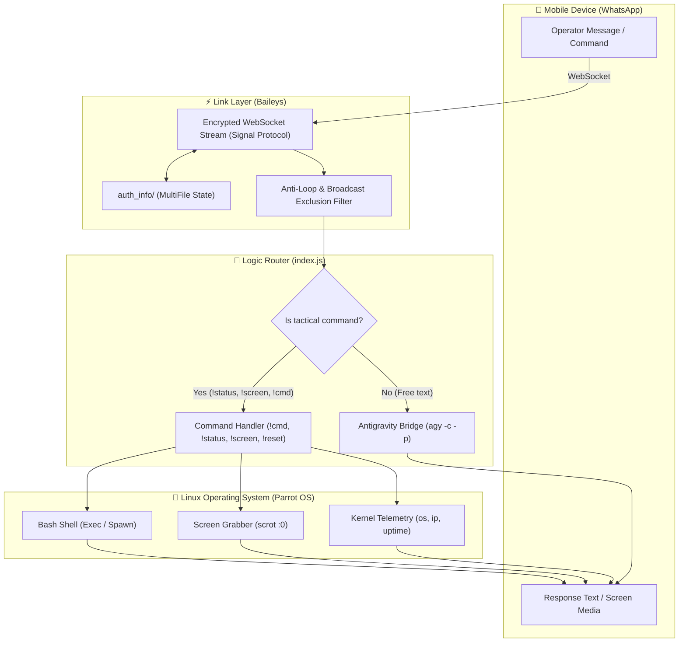

# WhatsApp Antigravity Bridge 🛰️⚡

<p align="center">
  <b>Available Languages / Idiomas disponibles:</b><br>
  <a href="README.en.md">🇺🇸 <b>English</b></a> &nbsp;•&nbsp; <a href="README.md">🇪🇸 <b>Español</b></a>
</p>

<p align="center">
  <a href="LICENSE"></a>
  
  =18.0.0">
  
  
  
  
</p>

```
  ██╗    ██╗██╗  ██╗ █████╗ ████████╗███████╗██████╗ ██████╗ ██╗██████╗  ██████╗ ███████╗
  ██║    ██║██║  ██║██╔══██╗╚══██╔══╝██╔════╝██╔══██╗██╔══██╗██║██╔══██╗██╔════╝ ██╔════╝
  ██║ █╗ ██║███████║███████║   ██║   ███████╗██████╔╝██████╔╝██║██║  ██║██║  ███╗█████╗  
  ██║███╗██║██╔══██║██╔══██║   ██║   ╚════██║██╔══██╗██╔══██╗██║██║  ██║██║   ██║██╔══╝  
  ╚███╔███╔╝██║  ██║██║  ██║   ██║   ███████║██████╔╝██║  ██║██║██████╔╝╚██████╔╝███████╗
   ╚══╝╚══╝ ╚═╝  ╚═╝╚═╝  ╚═╝   ╚═╝   ╚══════╝╚═════╝ ╚═╝  ╚═╝╚═╝╚═════╝  ╚═════╝ ╚══════╝
         Tactical Remote Bridge & Autonomous AI Assistant for Linux via WhatsApp
```

**WhatsApp Antigravity Bridge** is a tactical remote bridge and automation framework that links an authenticated **WhatsApp** session directly with your local **Linux** system (engineered for **Parrot Security OS** and Debian/Arch-based distributions). It merges the conversational intelligence and agentic coding power of **Google Antigravity CLI** (`agy`) with tactical remote shell execution, real-time hardware diagnostics, and desktop visual telemetry.

---

## 📑 Table of Contents

- [🎯 Motivation & Philosophy](#-motivation--philosophy)
- [🏗️ System Architecture](#️-system-architecture)
- [⚡ Key Breakthrough Capabilities](#-key-breakthrough-capabilities)
- [🛠️ Prerequisites](#️-prerequisites)
- [📦 Installation & Setup](#-installation--setup)
- [🚀 Execution Modes](#-execution-modes)
  - [1. Manual Execution](#1-manual-execution)
  - [2. 24/7 Persistent Daemon Setup (systemd)](#2-247-persistent-daemon-setup-systemd)
- [🎮 Tactical Command Reference](#-tactical-command-reference)
- [🛡️ Security Architecture & Threat Model](#️-security-architecture--threat-model)
- [🔧 Troubleshooting & FAQ](#-troubleshooting--faq)
- [🛣️ Roadmap](#️-roadmap)
- [📄 License & Credits](#-license--credits)

---

## 🎯 Motivation & Philosophy

During field operations, Red Team engagements, remote system administration, or pentesting audits, operators often need access to their primary workstation while away from their physical desk. This bridge enables:
1. **Secure Tactical Access:** Execute shell diagnostics, retrieve system telemetry, and launch assessment scripts without exposing vulnerable SSH ports to the public internet.
2. **AI Assistance on the Go:** Interact with **Google Antigravity** from your mobile device while retaining conversational context (`-c`) across exchanges.
3. **Ultra-Lightweight Footprint:** Built on direct WebSockets using `@whiskeysockets/baileys` rather than heavyweight headless Chromium/Puppeteer processes, consuming **less than 80 MB of RAM**.

---

## 🏗️ System Architecture

Data flows asynchronously and without blocking via the Node.js event-driven architecture:



---

## ⚡ Key Breakthrough Capabilities

### 1. 🧠 Conversational AI with Continuous Memory (`Google Antigravity`)
* Standard text messages sent to the bot are dispatched to Antigravity via `agy -c -p "<prompt>"`.
* The `-c` continuous flag retains full prior dialogue context, enabling progressive coding sessions, technical troubleshooting, and interactive problem solving.
* Includes dynamic response chunking (`sendChunked`) to adhere to WhatsApp's character limits (up to 3800 characters per message).

### 2. 💻 Remote Command Execution (`!cmd`)
* Dispatches any bash command directly to the Linux terminal with an automated 35-second safety timeout.
* Captures both `stdout` and `stderr`, wrapping outputs in monospaced Markdown code fences for mobile readability.

### 3. 📊 Hardware & Network Telemetry (`!status`)
* Instant diagnostics report containing:
  * Hostname.
  * Real-time RAM utilization (used vs. total in GB).
  * System uptime in hours.
  * Local IP address of the active network interface.

### 4. 📸 Desktop Screen Capture (`!screen`)
* Interfaces with the X11 display server (`DISPLAY=:0`) to snapshot the desktop using `scrot`.
* Sends the image directly to WhatsApp with a timestamp caption and safely removes the temporary file from `/tmp`.

### 5. 🔄 Memory Reset (`!reset`)
* Signals Antigravity to flush its current dialogue buffer and initiate a fresh context without restarting the bridge process.

### 6. 🛡️ Loop Protection & Defensive Filtering
* Caches the last 2000 sent message IDs (`sentMessageIds`) to avoid infinite self-reply loops.
* Discards WhatsApp status updates and broadcast messages (`status@broadcast`) to prevent accidental AI triggers.

---

## 🛠️ Prerequisites

### Linux System Utilities
On Debian, Parrot OS, or Ubuntu:
```bash
sudo apt update && sudo apt install -y curl git scrot feh python3 python3-qrcode
```

### Node.js Runtime
Node.js **v18.x** or **v22.x** is recommended:
```bash
node -v   # Must be >= v18.0.0
npm -v
```

### Antigravity CLI
Ensure `agy` is installed and available in your system `$PATH`:
```bash
which agy
agy --version
```

---

## 📦 Installation & Setup

1. **Clone the repository:**
   ```bash
   git clone https://github.com/rodrigo47363/whatsapp-antigravity-bridge.git
   cd whatsapp-antigravity-bridge
   ```

2. **Install Node dependencies:**
   ```bash
   npm install
   ```

3. **Make the startup script executable:**
   ```bash
   chmod +x start_whatsapp.sh
   ```

---

## 🚀 Execution Modes

### 1. Manual Execution
Ideal for initial pairing and debugging:
```bash
./start_whatsapp.sh
```
* **First run:** A QR code will pop up via `feh` on your desktop and print in ASCII inside the terminal. Scan it with WhatsApp (**Linked Devices > Link a Device**).
* **Subsequent runs:** Credentials remain securely saved in `auth_info/`, connecting automatically.

### 2. 24/7 Persistent Daemon Setup (systemd)
To ensure the bot runs continuously across reboots:

1. **Create systemd user directory:**
   ```bash
   mkdir -p ~/.config/systemd/user/
   ```

2. **Copy the service template:**
   ```bash
   cp whatsapp-bridge.service.example ~/.config/systemd/user/whatsapp-bridge.service
   ```

3. **Reload systemd and enable the unit:**
   ```bash
   systemctl --user daemon-reload
   systemctl --user enable --now whatsapp-bridge.service
   ```

4. **Inspect live logs and status:**
   ```bash
   systemctl --user status whatsapp-bridge.service
   journalctl --user -u whatsapp-bridge.service -f
   ```

---

## 🎮 Tactical Command Reference

| Command | Syntax | Example | Description |
| :--- | :--- | :--- | :--- |
| **Conversational AI** | `<text>` | `Explain the mechanics of AS-REP Roasting` | Queries Antigravity with preserved conversation memory. |
| **System Telemetry** | `!status` | `!status` | Returns RAM usage, Uptime, Hostname, and Interface IP. |
| **Screen Capture** | `!screen` | `!screen` | Captures `:0` desktop and transmits it as media. |
| **Bash Execution** | `!cmd <command>` | `!cmd ip a` / `!cmd nmap -sV 192.168.1.1` | Runs bash command and returns formatted terminal output. |
| **Memory Reset** | `!reset` | `!reset` | Clears Antigravity's conversation buffer. |
| **Help Menu** | `!help` | `!help` | Displays the operational command menu. |

---

## 🛡️ Security Architecture & Threat Model

> [!CAUTION]
> The `!cmd` directive executes terminal commands on your host with the exact privileges of the running Node.js user.

* **Credential Isolation (`.gitignore`):** The `auth_info/` directory contains sensitive elliptic curve cryptographic keys. It is strictly excluded from version control.
* **Access Control (JID Whitelisting):** For production environments, it is strongly advised to restrict message processing to your authorized WhatsApp JID:
  ```javascript
  const AUTHORIZED_JID = 'YOUR_PHONE_NUMBER@s.whatsapp.net';
  if (from !== AUTHORIZED_JID) {
      console.log(`[!] Unauthorized message from: ${from}`);
      return;
  }
  ```
* **No Plaintext Secrets:** Do not commit API keys or environment credentials to the public repository.

---

## 🔧 Troubleshooting & FAQ

### `Bad MAC` Warnings on Reconnect
* **Cause:** Transient Signal protocol decryption warnings when processing backlog messages received while the bot was offline.
* **Resolution:** Normal protocol behavior. These messages are discarded automatically once session keys align with the WhatsApp server.

### `!screen` Fails: "Error al capturar pantalla"
* **Cause:** The `DISPLAY` environment variable does not match the active X11 graphical session.
* **Resolution:** Ensure the running environment or `systemd` unit file exports `Environment="DISPLAY=:0"`.

### Antigravity Timeout Warning
* **Cause:** Heavy LLM queries taking longer than 90 seconds.
* **Resolution:** Adjust the timeout threshold in `queryAntigravity()` inside `index.js`.

---

## 🛣️ Roadmap

- [x] Native Baileys v7 WebSocket integration.
- [x] Dual QR visualizer (Terminal ASCII + X11 `feh` pop-up).
- [x] Tactical commands (`!cmd`, `!status`, `!screen`, `!reset`).
- [x] Continuous AI integration with Google Antigravity CLI.
- [x] WhatsApp status broadcast exclusion filter.
- [ ] Whitelist configuration via `.env` file.
- [ ] Voice note transcription via local Whisper models.
- [ ] Bidirectional file transfer (`!download <path>` and `!upload`).

---

## 📄 License & Credits

Licensed under the **[MIT License](LICENSE)**.

Developed and maintained by **[rodrigo47363](https://github.com/rodrigo47363)**.
Engineered for tactical automation, remote system administration, and authorized offensive security research.
