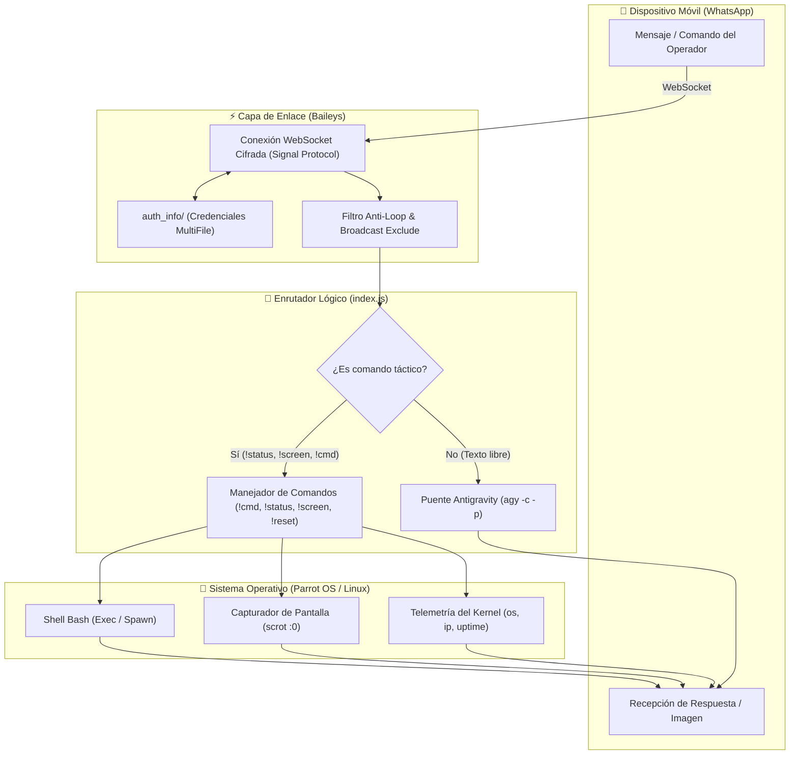

# WhatsApp Antigravity Bridge 🛰️⚡

<p align="center">
  <b>Idiomas disponibles / Available Languages:</b><br>
  <a href="README.md">🇪🇸 <b>Español</b></a> &nbsp;•&nbsp; <a href="README.en.md">🇺🇸 <b>English</b></a>
</p>

<p align="center">
  <a href="LICENSE"></a>
  
  =18.0.0">
  
  
  
  
</p>

```
  ██╗    ██╗██╗  ██╗ █████╗ ████████╗███████╗██████╗ ██╗██████╗  ██████╗ ███████╗
  ██║    ██║██║  ██║██╔══██╗╚══██╔══╝██╔════╝██╔══██╗██║██╔══██╗██╔════╝ ██╔════╝
  ██║ █╗ ██║███████║███████║   ██║   ███████╗██████╔╝██║██║  ██║██║  ███╗█████╗  
  ██║███╗██║██╔══██║██╔══██║   ██║   ╚════██║██╔══██╗██║██║  ██║██║   ██║██╔══╝  
  ╚███╔███╔╝██║  ██║██║  ██║   ██║   ███████║██████╔╝██║██████╔╝╚██████╔╝███████╗
   ╚══╝╚══╝ ╚═╝  ╚═╝╚═╝  ╚═╝   ╚═╝   ╚══════╝╚═════╝ ╚═╝╚═════╝  ╚═════╝ ╚══════╝
      Tactical Remote Bridge & Autonomous AI Assistant for Linux via WhatsApp
```

**WhatsApp Antigravity Bridge** es un puente táctico y framework de control remoto que enlaza una sesión autenticada de **WhatsApp** con el entorno operativo local de **Linux** (optimizado para **Parrot Security OS** y distribuciones basadas en Debian/Arch). Integra la potencia conversacional y agentic coding de **Google Antigravity CLI** (`agy`) con capacidades tácticas de ejecución remota de comandos, diagnóstico de hardware y telemetría visual.

---

## 📑 Tabla de Contenidos

- [🎯 Motivación y Filosofía](#-motivación-y-filosofía)
- [🏗️ Arquitectura del Sistema](#️-arquitectura-del-sistema)
- [⚡ Capacidades Principales](#-capacidades-principales)
- [🛠️ Requisitos Previos](#️-requisitos-previos)
- [📦 Instalación y Configuración](#-instalación-y-configuración)
- [🚀 Métodos de Ejecución](#-métodos-de-ejecución)
  - [1. Ejecución Manual](#1-ejecución-manual)
  - [2. Despliegue como Demonio Persistente (systemd)](#2-despliegue-como-demonio-persistente-systemd)
- [🎮 Referencia Táctica de Comandos](#-referencia-táctica-de-comandos)
- [🛡️ Modelo de Seguridad y Buenas Prácticas](#️-modelo-de-seguridad-y-buenas-prácticas)
- [🔧 Resolución de Problemas (Troubleshooting)](#-resolución-de-problemas-troubleshooting)
- [🛣️ Roadmap](#️-roadmap)
- [📄 Licencia y Créditos](#-licencia-y-créditos)

---

## 🎯 Motivación y Filosofía

En operaciones de campo, auditorías de seguridad, tareas de administración de sistemas o durante auditorías de Red Team, los operadores no siempre se encuentran frente al teclado físico de su estación de trabajo. Este puente permite:
1. **Acceso Táctico Seguro:** Ejecutar diagnósticos, consultar telemetría y disparar herramientas de terminal sin necesidad de abrir túneles SSH hacia redes externas.
2. **Asistencia de IA en Movimiento:** Interactuar con el agente **Antigravity** desde el teléfono móvil conservando la memoria conversacional entre mensajes (`-c`).
3. **Cero Dependencias Pesadas:** A diferencia de soluciones basadas en Selenium o Puppeteer, utiliza WebSockets puros mediante la librería `@whiskeysockets/baileys`, reduciendo el consumo de RAM a menos de **80 MB**.

---

## 🏗️ Arquitectura del Sistema

El flujo de información opera de manera asíncrona y no bloqueante mediante el ciclo de eventos de Node.js:



---

## ⚡ Capacidades Principales

### 1. 🧠 Asistente de IA con Memoria Continua (`Google Antigravity`)
* Cada mensaje convencional enviado al bot es transferido a Antigravity mediante el comando `agy -c -p "<texto>"`.
* El parámetro `-c` garantiza que el contexto de las consultas anteriores permanezca activo, permitiendo conversaciones fluidas, resolución iterativa de código y asistencia en auditorías técnicas.
* Implementa división automática de respuestas largas (`sendChunked`) para respetar los límites de caracteres de WhatsApp (hasta 3800 caracteres por fragmento).

### 2. 💻 Ejecución Remota de Comandos (`!cmd`)
* Permite despachar cualquier comando de terminal directamente al shell de Linux con un timeout defensivo de 35 segundos.
* Toda la salida de texto (`stdout` y `stderr`) es formateada en bloques de código Markdown monoespaciados para lectura clara en la pantalla móvil.

### 3. 📊 Telemetría y Salud del Sistema (`!status`)
* Reporte instantáneo que incluye:
  * Nombre de host del equipo.
  * Consumo exacto de memoria RAM (usada vs. total en GB).
  * Tiempo de actividad del sistema (*Uptime* en horas).
  * Dirección IP local asignada a la interfaz activa de red.

### 4. 📸 Captura de Escritorio en Tiempo Real (`!screen`)
* Accede al servidor de despliegue gráfico (`DISPLAY=:0`) y toma una instantánea fiel del escritorio mediante `scrot`.
* La imagen se transmite directamente como archivo multimedia a WhatsApp con indicación horaria y se limpia automáticamente de `/tmp` para no dejar artefactos residuales.

### 5. 🔄 Gestión y Purga de Contexto (`!reset`)
* Envía la señal de restablecimiento de memoria a Antigravity para iniciar un nuevo contexto conversacional limpio sin reiniciar el proceso del bot.

### 6. 🛡️ Filtros Anti-Eco y Prevención de Bucles
* Registro en caché de los últimos 2000 IDs de mensajes generados por el bot (`sentMessageIds`).
* Detección y descarte estricto de mensajes de estado/difusión (`status@broadcast`) para evitar ejecuciones accidentales originadas por historias de contactos.

---

## 🛠️ Requisitos Previos

### Paquetes del Sistema Operativo
En distribuciones basadas en Debian / Parrot OS / Ubuntu:
```bash
sudo apt update && sudo apt install -y curl git scrot feh python3 python3-qrcode
```

### Entorno Node.js
Se recomienda **Node.js v18.x** o **v22.x** (administrado preferentemente vía NVM):
```bash
node -v   # Debe retornar v18.0.0 o superior
npm -v
```

### Antigravity CLI
Asegúrate de tener el binario `agy` accesible en tu terminal:
```bash
which agy
agy --version
```

---

## 📦 Instalación y Configuración

1. **Clonar el repositorio:**
   ```bash
   git clone https://github.com/rodrigo47363/whatsapp-antigravity-bridge.git
   cd whatsapp-antigravity-bridge
   ```

2. **Instalar dependencias de Node.js:**
   ```bash
   npm install
   ```

3. **Verificar permisos del script de inicio:**
   ```bash
   chmod +x start_whatsapp.sh
   ```

---

## 🚀 Métodos de Ejecución

### 1. Ejecución Manual
Para realizar pruebas directas o el primer emparejamiento por código QR:
```bash
./start_whatsapp.sh
```
* **Primer emparejamiento:** El script desplegará el código QR en una ventana emergente (`feh`) y en formato ASCII dentro de la terminal. Escanéalo en WhatsApp (**Dispositivos Vinculados > Vincular un dispositivo**).
* **Sesiones posteriores:** Las credenciales quedan almacenadas de forma local en la carpeta `auth_info/`. El inicio es completamente automático.

### 2. Despliegue como Demonio Persistente (systemd)
Para mantener el bot ejecutándose permanentemente en segundo plano, reiniciándose ante fallos y arrancando con el sistema:

1. **Crear el directorio de servicios de usuario (si no existe):**
   ```bash
   mkdir -p ~/.config/systemd/user/
   ```

2. **Copiar y ajustar la plantilla del servicio:**
   ```bash
   cp whatsapp-bridge.service.example ~/.config/systemd/user/whatsapp-bridge.service
   ```

3. **Recargar systemd y habilitar el servicio:**
   ```bash
   systemctl --user daemon-reload
   systemctl --user enable --now whatsapp-bridge.service
   ```

4. **Verificar estado y registros en vivo:**
   ```bash
   systemctl --user status whatsapp-bridge.service
   journalctl --user -u whatsapp-bridge.service -f
   ```

---

## 🎮 Referencia Táctica de Comandos

| Comando | Sintaxis | Ejemplo | Acción Realizada |
| :--- | :--- | :--- | :--- |
| **Conversación Libre** | `<texto>` | `Explica cómo funciona Kerberoasting` | Consulta enviada a Antigravity con contexto continuo. |
| **Telemetría** | `!status` | `!status` | Retorna RAM usada/total, Uptime, Hostname e IP de red. |
| **Captura de Pantalla** | `!screen` | `!screen` | Captura el escritorio `:0` y lo envía como foto adjunta. |
| **Ejecución Bash** | `!cmd <comando>` | `!cmd ip a` / `!cmd rustscan -a 10.10.10.1` | Ejecuta el comando en Linux y retorna la salida formateada. |
| **Limpieza de Memoria** | `!reset` | `!reset` | Reinicia la memoria de diálogo de Antigravity. |
| **Ayuda** | `!help` | `!help` | Muestra el menú de comandos en el chat. |

---

## 🛡️ Modelo de Seguridad y Buenas Prácticas

> [!CAUTION]
> El comando `!cmd` otorga acceso de ejecución de comandos en la terminal de tu máquina con los mismos permisos del usuario que ejecuta Node.js.

* **Protección de Credenciales (`.gitignore`):** El directorio `auth_info/` contiene material criptográfico sensible (claves privadas de curva elíptica del protocolo Signal). Este proyecto **nunca** sube dicha carpeta.
* **Restricción de Acceso (Whitelist JID):** En entornos de producción, se recomienda descomentar o añadir la validación de `from` en `index.js` para aceptar únicamente el número telefónico del propietario:
  ```javascript
  const AUTHORIZED_JID = 'TU_NUMERO@s.whatsapp.net';
  if (from !== AUTHORIZED_JID) {
      console.log(`[!] Mensaje no autorizado de: ${from}`);
      return;
  }
  ```
* **Variables de Entorno y Secretos:** Nunca expongas tokens ni claves de API en texto claro dentro del repositorio.

---

## 🔧 Resolución de Problemas (Troubleshooting)

### Advertencias de `Bad MAC` al reconectar
* **Causa:** Ocurre comúnmente en Baileys cuando se acumulan mensajes cifrados pendientes durante el tiempo en que el bot estuvo desconectado.
* **Solución:** Son advertencias normales del protocolo Signal que no interrumpen el servicio. Se descartan automáticamente una vez que la sesión se sincroniza con el servidor.

### Error en `!screen`: "Error al capturar pantalla"
* **Causa:** Ocurre si la variable `DISPLAY` no apunta a la sesión gráfica activa (generalmente `:0` en X11).
* **Solución:** Asegúrate de ejecutar el bot desde una sesión gráfica o que el servicio `systemd` incluya `Environment="DISPLAY=:0"`.

### "Timeout: Antigravity tardó más de 90 segundos"
* **Causa:** Consultas con requerimientos computacionales muy pesados o tareas complejas de compilación.
* **Solución:** Puedes ajustar el umbral de timeout en la función `queryAntigravity` dentro de `index.js`.

---

## 🛣️ Roadmap

- [x] Conexión nativa con Baileys v7.
- [x] Renderizador dual de QR (ASCII terminal + GUI X11 `feh`).
- [x] Comandos tácticos (`!cmd`, `!status`, `!screen`, `!reset`).
- [x] Integración conversacional continua con Google Antigravity CLI.
- [x] Filtro contra estados y difusiones de WhatsApp.
- [ ] Whitelist interactiva configurable mediante archivo `.env`.
- [ ] Soporte para transcripción de audios de voz mediante Whisper local.
- [ ] Transferencia bidireccional de archivos (`!download <path>` y `!upload`).

---

## 📄 Licencia y Créditos

Este proyecto está licenciado bajo los términos de la Licencia **[MIT](LICENSE)**.

Desarrollado y mantenido por **[rodrigo47363](https://github.com/rodrigo47363)**.
Orientado a la automatización táctica, administración remota y hacking ético en entornos autorizados.
